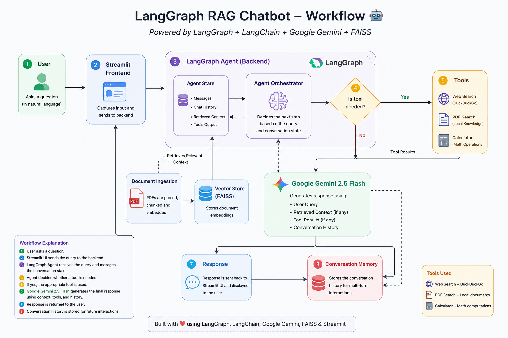
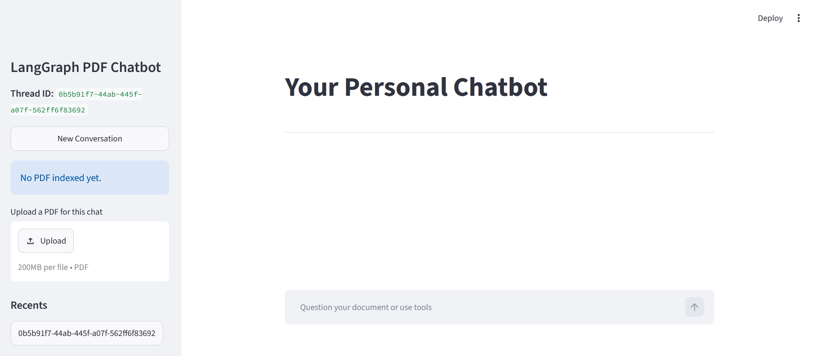

# 🤖 LangGraph RAG Chatbot

A production-ready **Retrieval-Augmented Generation (RAG)** chatbot built using **LangGraph**, **LangChain**, **Google Gemini 2.5 Flash**, **FAISS**, and **Streamlit**.

The chatbot allows users to upload PDF documents, ask natural language questions, retrieve context from the uploaded document, perform web searches, fetch live stock prices, and execute mathematical calculations—all within a single conversational interface.

---

## Features

- 📄 Upload PDF documents
- 🧠 Retrieval-Augmented Generation (RAG)
- 💬 Multi-turn conversations
- 🧵 Persistent conversation threads
- 🌐 DuckDuckGo Web Search
- 📈 Live Stock Price Tool
- ➗ Calculator Tool
- ⚡ LangGraph Agent Workflow
- 🔍 FAISS Vector Database
- 🎨 Clean Streamlit Interface

---

# Tech Stack

| Category             | Technology              |
| -------------------- | ----------------------- |
| LLM                  | Google Gemini 2.5 Flash |
| Embeddings           | Gemini Embedding 001    |
| Agent Framework      | LangGraph               |
| Orchestration        | LangChain               |
| Vector Database      | FAISS                   |
| UI                   | Streamlit               |
| PDF Parsing          | PyPDF                   |
| Web Search           | DuckDuckGo Search       |
| Programming Language | Python                  |


---

## Workflow

<p align="center">
  
</p>

# Project Structure

```
LangGraph-RAG-Chatbot/
│
├── assets/
│   └── Screenshots/
│
├── Streamlit_Frontend.py
├── Langgraph_backend.py
│
├── requirements.txt
├── README.md
├── LICENSE
├── .env
├── .gitignore
└── .venv/
```

---

# Installation

Clone the repository

```bash
git clone https://github.com/yourusername/LangGraph-RAG-Chatbot.git
```

Go inside the project

```bash
cd LangGraph-RAG-Chatbot
```

Create virtual environment

```bash
python -m venv .venv
```

Activate environment

Windows

```bash
.venv\Scripts\activate
```

Linux/Mac

```bash
source .venv/bin/activate
```

Install dependencies

```bash
pip install -r requirements.txt
```

---

# Environment Variables

Create a `.env` file.

```env
GOOGLE_API_KEY=your_gemini_key
```

---

# Run the Application

```bash
streamlit run app.py
```

---

# Application Screenshots

## Homepage



---

## Uploading a PDF


---

## Chat Example


---

## RAG Response


---

## Tool Calling Example

The chatbot can automatically invoke external tools like web search, stock price lookup, and calculator.


---

## Conversation History

Previous conversations are stored using LangGraph thread memory.


---

# Agent Workflow

```
                 User Query
                      │
                      ▼
                LangGraph Agent
                      │
        ┌─────────────┼──────────────┐
        ▼             ▼              ▼
      RAG         Web Search     Stock Tool
        │             │              │
        └─────────────┼──────────────┘
                      ▼
                 Gemini 2.5 Flash
```

---

# Current Features

✔ Multi-thread conversations

✔ PDF Retrieval-Augmented Generation

✔ FAISS Vector Store

✔ LangGraph Memory

✔ Tool Calling

✔ DuckDuckGo Search

✔ Stock Price Lookup

✔ Calculator Tool

✔ Streamlit UI

---

# Future Improvements

- Authentication
- Persistent PDF Storage
- Database Integration
- Multi-document Retrieval
- Cloud Deployment
- Chat Export
- Conversation Search
- Docker Support
- CI/CD Pipeline
- User Accounts

---

# Author

**Dhruv Patel**

AI • Machine Learning • Deep Learning • Generative AI • LangGraph • LangChain • Python

---

# License

This project is licensed under the MIT License.
